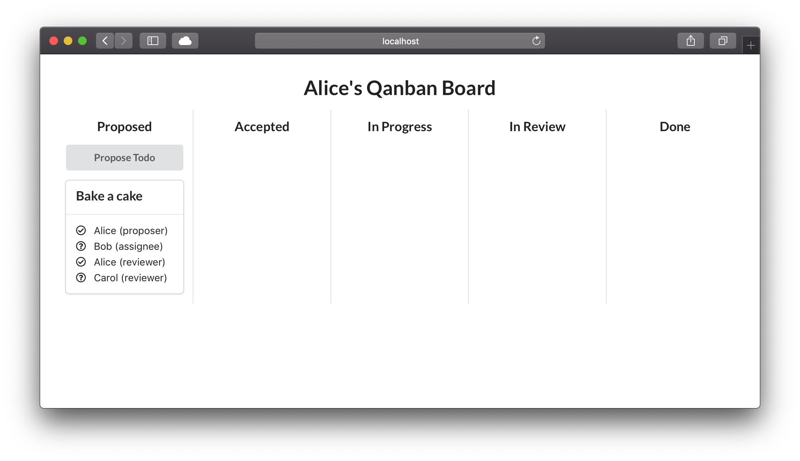

# qanban

A case study about a distributed kanban board.

The system consists of two components:
- `qanban-router`: A very simplistic message queue that routes messages
  between the participants of a _qanban_ network and buffers message
  while participants are offline.
- `qanban-node`: A participant node of the _qanban_ network. Each node
  provides access to the distributed kanban board via a simple web
  frontend.

Currently, everything is implemented in TypeScript using node.js for the
backend parts and React for the frontend parts. The nodes preserve their
state between restarts in an SQLite database store in a file.


## Install & build

This project uses yarn workspaces, hence you need yarn (and not npm).
To install all dependencies and build all components, run
```console
yarn install
yarn workspaces run build
```
at the root of the repository.

## Run

To start the `qanban-router`, execute
```console
yarn run qanban-router
```
at the root of the repository. The router listens on the port given in the
environment variable `PORT` and defaults to 7475 if that variable is not set.

To start a `qanban-node`, execute
```console
yarn run qanban-node --name <participant-name> --port <frontend-port>
```
at the root of the repository. `<participant-name>` is the name of the
participant, for instance "Alice". `<frontend-port>` is the port the web
frontent will listen on. Currently, each node will look for a router
on port 7475 on localhost and connect to it. Nodes persist their internal
state in an SQLite database in the current directory, i.e. the root of the
repository, between runs. This database is stored in
`~/.config/qanban/<participant-name>.db`.

For example, to start a node for Alice and serve her frontend on http://localhost:3000, call
```console
yarn run qanban-node --name Alice --port 3000
```

## Demo

Our demo will consist of a network with three participants, Alice, Bob
and Carol. First, we only start the router and the nodes for Alice and
Bob, by calling the following three commands, each in a separate terminal
window:
```console
yarn run qanban-router
```
```console
yarn run qanban-node --name Alice --port 3000
```
```console
yarn run qanban-node --name Bob --port 4000
```

Next, we impersonate Alice and propose a todo item for Bob to bake her a
cake. Since Carol is a cake lover too, Alice also wants her approval before
the todo can be considerer done. Thus Alice navigates to her frontend at
http://localhost:3000 and finds a screen looking like:


She open's a new todo by clicking the "Propose Todo" button, filling out the
form and clicking "Submit":


The resulting screen shows that Alice has successfully submitted her
proposal:



Next, we impersonate Bob, open his frontend at http://localhost:4000 and are
presented with a very similar screen. Bob can accept the proposal by
clicking the "Accept" button. This does not move the todo into the
"Accepted" column since Carol's approval is still missing, which is
indicated by the question mark left of her name. If we go back to Alice'
frontend, we can see that the question mark left of Bob's name has turned
into a check mark, indicating his approval.

In order to finally record Carol's approval, we start her node by running
```console
yarn run qanban-node --name Carol --port 5000
```
in yet another terminal and point our browser to http://localhost:5000.
Clicking "Accept" will move the todo into the "Accepted" column on
everybody's screen.

Moving on from there, Bob can move the todo into the "In Progress" column by
clicking "Start" and later into the "In Review" column by clicking "Finish".

Once Bob has done that, both Alice and Carol are given the opportunity to
review his work and record their verdict on the kanban board by either
clicking "Approve" or "Reject":


When they click "Reject", they are asked to provide a comment why they reject
and the todo moves back into the "In Progress" column, now also showing the
comment given for rejection. Bob can move it back to the "In Review" column from there by clicking "Finish" again (after he has addressed the comment,
of course). Once all reviewers, i.e. Alice and Carol, have approved, the
todo moves into the "Done" column, where it will stay forever.
